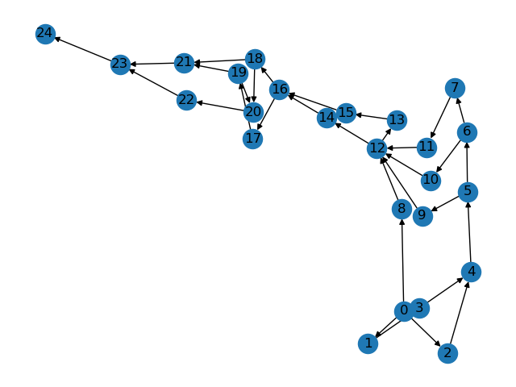

# Build Lattice with networkx

## Libraries
- [pyahocorasick](https://github.com/WojciechMula/pyahocorasick/)
- [networkx(v2.5)](https://networkx.org/)


## Preprocessing
1. download a sample text
```bash
wget -P data/ http://www.cl.ecei.tohoku.ac.jp/nlp100/data/neko.txt
```

2. tokenize with [mecab](https://taku910.github.io/mecab/)
```bash
cat data/neko.txt | mecab -O wakati > data/neko.txt.wakati
```

3. build a vocab
```bash
python build_vocab.py --text-file data/neko.txt.wakati --vocab-file data/vocab.txt
```


## Build Lattice
```bash
python build_lattice.py --vocab-file data/vocab.txt --graph-file figure/lattice.png
```

outputs
```
 1|吾　　　　　　　　　　　　　　　|(0, 1)
 2|吾輩　　　　　　　　　　　　　　|(0, 2)
 3|　輩　　　　　　　　　　　　　　|(1, 2)
 4|　　は　　　　　　　　　　　　　|(2, 3)
 5|　　　猫　　　　　　　　　　　　|(3, 4)
 6|　　　　で　　　　　　　　　　　|(4, 5)
 7|　　　　　あ　　　　　　　　　　|(5, 6)
 8|吾輩は猫である　　　　　　　　　|(0, 7)
 9|　　　　である　　　　　　　　　|(4, 7)
10|　　　　　ある　　　　　　　　　|(5, 7)
11|　　　　　　る　　　　　　　　　|(6, 7)
12|　　　　　　　。　　　　　　　　|(7, 8)
13|　　　　　　　　名　　　　　　　|(8, 9)
14|　　　　　　　　名前　　　　　　|(8, 10)
15|　　　　　　　　　前　　　　　　|(9, 10)
16|　　　　　　　　　　は　　　　　|(10, 11)
17|　　　　　　　　　　　ま　　　　|(11, 12)
18|　　　　　　　　　　　まだ　　　|(11, 13)
19|　　　　　　　　　　　　だ　　　|(12, 13)
20|　　　　　　　　　　　　　な　　|(13, 14)
21|　　　　　　　　　　　　　ない　|(13, 15)
22|　　　　　　　　　　　　　　い　|(14, 15)
23|　　　　　　　　　　　　　　　。|(15, 16)
```

